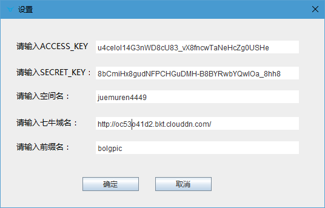

# 七牛上传工具
## 初衷
看到Mac上有几个不错的支持七牛上传的工具，发现Windows下并没有，而且七牛官方有现成的API，就想自己尝试做一个出来，本人安卓开发，第一次开发java图形化程序，如有不足之处，大家尽情指出。
## 使用方法
直接将文件拖动到窗口即可开始上传，首次上传会自动跳转到设置，需要填写配置，上传完成后会自动将链接复制到剪贴板，直接粘贴即可使用。

设置示例：（需要去自己的七牛后台找到自己的信息）

目前只测试过小文件，上百兆的未测试，建议用来上传图片或小文件，大文件可以使用七牛web端上传工具或者官方的其他工具。
## 截图

## 开发工具
Eclipse + WindowBuilder
## 下载
[七牛上传工具](https://github.com/juemuren4449/QiNiuUpLoad/七牛上传工具.exe?raw=true)
## 联系方式
邮箱：juemuren_dev@163.com